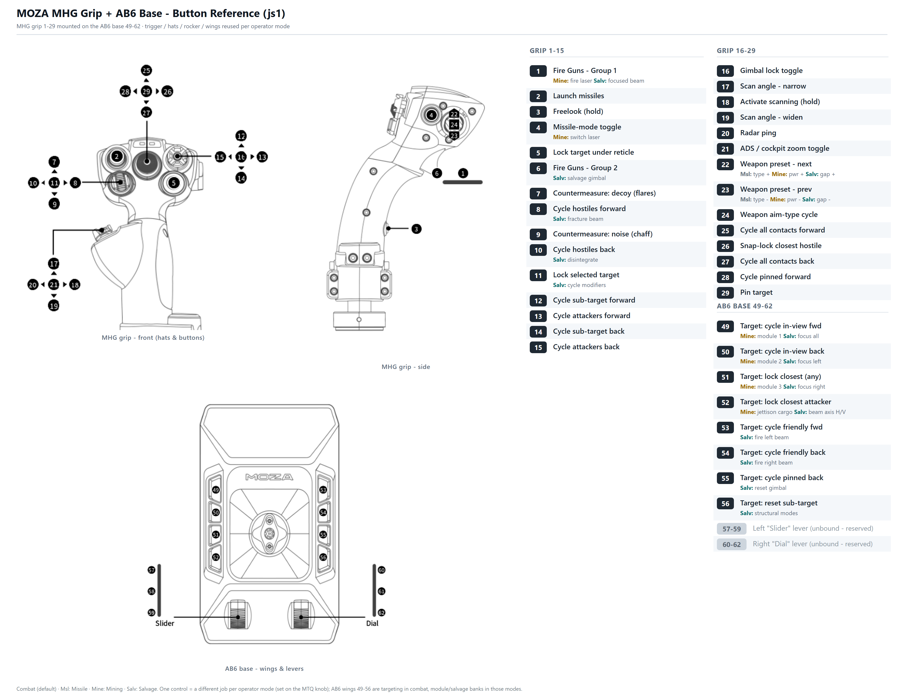
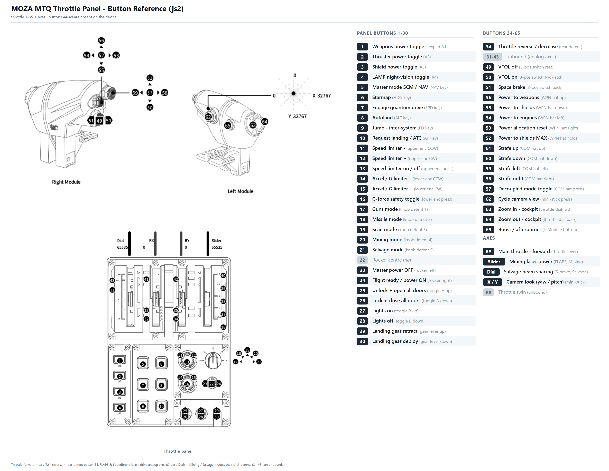

# MOZA HOTAS — Star Citizen Binding Profile

[](MOZA.xml)
[](#status)
[](https://robertsspaceindustries.com/)
[](MOZA.xml)
[](#requirements)
[](#requirements)
[](LICENSE)

A complete, hand-tuned Star Citizen control-mapping profile for a **MOZA flight setup** —
MHG grip on an AB6 FFB base, plus an MTQ throttle quadrant. The whole rig drives flight,
combat, mining, and salvage from physical controls, with every binding documented and
verified in-game.

> **All you actually need from this repo is [`MOZA.xml`](MOZA.xml).** Everything else is
> documentation, reference art, and the scripts that regenerate it. See
> [Installing](#installing) for the two ways to put it in place.

---

## Requirements

This profile is tuned to one specific rig. To **use it as-is** you need:

| | Requirement | Why |
| --- | --- | --- |
| 🪟 | **Windows** | Star Citizen is Windows-only, and the profile binds devices by their **DirectInput GUIDs**. No macOS/Linux. |
| 🕹️ | **MOZA MHG grip + MOZA AB6 FFB base + MOZA MTQ Throttle Panel** | Every binding maps to these exact devices. Different hardware → the device GUIDs won't match and bindings land nowhere. |
| 🚀 | **Star Citizen** (captured against **Alpha 4.8**) | Action names (`v_*`) are CIG's; a major patch can rename or remove some. |
| ⚙️ | **MOZA Cockpit / Pithouse** configurator | A couple of device-side settings are assumed on — notably **"Detent Button Mapping" ON** (so the throttle rear detent emits button 34 for reverse) and **mixed-mode** on the AB6/MTQ levers (so the sliders emit an analog axis). |

> **Don't have this exact rig?** You can still read the bindings as a starting point and
> rebind to your own devices — but the GUIDs in [`MOZA.xml`](MOZA.xml) are MOZA-specific, so
> it won't load cleanly onto other hardware without editing.

**Only needed to regenerate the docs/cards** (not to *use* the profile): Windows PowerShell
with .NET `System.Drawing`, **Chrome or Edge** (headless SVG→PNG), and internet access for the
keybind-database refresh. Details in [`CLAUDE.md` §7–8](CLAUDE.md).

---

## Installing

Star Citizen loads control profiles from:

```
…\StarCitizen\LIVE\user\client\0\controls\mappings\
```

**Option A — just the file (minimal).** Copy [`MOZA.xml`](MOZA.xml) into that folder. That's it.

**Option B — the whole repo as your mappings folder (what the author does).** Clone this repo
*into* the mappings folder. The game only reads `MOZA.xml` at the root and **ignores
subfolders**, so the diagrams, cards, and tools come along harmlessly and you get the reference
material right where you fly:

```powershell
cd "…\StarCitizen\LIVE\user\client\0\controls\mappings\"
git clone https://github.com/bshehram/starcitizen-moza-hotas.git
# then copy starcitizen-moza-hotas\MOZA.xml up one level, or clone with the repo contents at the mappings root
```

**Then load it in-game**, either way:

- **Options → Keybindings → Control Profiles → Load**, or
- open the console (`` ` ``) and run `pp_rebindkeys MOZA.xml`.

Full instructions and the XML-format walkthrough are in [`CLAUDE.md` §2](CLAUDE.md).

---

## Hardware

| Game device | Physical hardware | Buttons | Axes |
| --- | --- | --- | --- |
| `js1` | **MOZA MHG** grip on **MOZA AB6 FFB** base (one DirectInput device) | grip 1–29, base 49–62 | roll / pitch / yaw twist + 2 lever axes |
| `js2` | **MOZA MTQ** Throttle Panel | 1–65 | throttle + camera mini-stick + 2 side sliders |

**Vehicle-only by design** — on foot the author plays on an Xbox controller, so this profile
binds only seat/vehicle contexts. See [`CLAUDE.md` §1](CLAUDE.md) for the full hardware map
and the device-instance caveat (keep USB enumeration order stable so `js1`/`js2` don't swap).

---

## Reference cards

Printable US-Letter cheat sheets (one per device), generated from the manufacturer diagrams.

| `js1` — MHG grip + AB6 base | `js2` — MTQ throttle |
| --- | --- |
|  |  |

---

## Repo layout

```
MOZA.xml            ← the profile the game loads — THE ONLY FILE YOU NEED (keep in root)
CLAUDE.md           ← the full reference: every binding explained, format docs, how-tos
diagrams/           ← manufacturer button-number maps (source art)
cards/              ← generated printable cheat sheets (PNG + editable SVG)
reference/          ← starbinder action catalogue (v4.8) + an HTML binding sheet
tools/              ← regeneration scripts (run from the project root)
```

## Tooling

Both scripts are PowerShell, run from the project root:

```powershell
powershell -ExecutionPolicy Bypass -File .\tools\refresh_keybinds_db.ps1   # refresh the action catalogue for a new SC patch
powershell -ExecutionPolicy Bypass -File .\tools\regen_cards.ps1           # rebuild the reference cards after a binding change
```

See [`CLAUDE.md` §7–8](CLAUDE.md) for what each does and when to run it.

---

## Status

- **XML parsing — passing.** `MOZA.xml` is well-formed (`xmllint --noout MOZA.xml` is clean);
  121 `<action>`/`<rebind>` pairs across 17 action maps, no action bound to two different inputs.
  Buttons that appear in several maps (trigger, rocker, hats, AB6 wings) are intentional
  **operator-mode reuse** — only one of those maps is live at a time. See [`CLAUDE.md` §5](CLAUDE.md).
- **Internally tested — in-game verified.** Bindings were validated in live Star Citizen (Alpha 4.8),
  including the mining-laser and salvage-spacing slider axes confirmed in a Golem and a Salvation.
  Action labels/descriptions were cross-checked against the
  [starbinder](https://starbinder.space/) master catalogue.

> Badges are self-reported (this is a personal config repo, not a CI'd codebase). The XML
> "passing" claim is reproducible locally with the `xmllint` command above; "tested" means
> hands-on in the game, documented binding-by-binding in `CLAUDE.md`.

---

## Contributing

Solo-maintained, but **PRs are welcome and will be reviewed** — corrections, bindings for other
MOZA layouts, newer-patch updates, or improvements to the docs/cards. Please:

- keep [`MOZA.xml`](MOZA.xml) loading cleanly (run `xmllint --noout MOZA.xml`), and
- if you change a binding, update its inline comment, the matching row in [`CLAUDE.md` §4](CLAUDE.md),
  and the card tables in `tools/regen_cards.ps1` (the cards aren't auto-derived from the XML — see [`CLAUDE.md` §8.3](CLAUDE.md)).

Open an issue first if it's a big change, so we don't duplicate effort.

---

## License & provenance

Released under the [MIT License](LICENSE) — © 2026 Basit Shehram.

Everything here is **original work** — the `MOZA.xml` profile, the `CLAUDE.md` reference, the
reference cards, the regeneration scripts, and the HTML binding sheet were all authored for this
repo. **No third-party profile generator is used anywhere**; the cards are built solely by the
in-repo `tools/regen_cards.ps1`.

Two third-party *inputs* are **not** covered by the MIT license and remain their owners' property:

- the **manufacturer diagrams** (`diagrams/*.png`) — MOZA's own button-number art, used as the
  source layer for the cards; and
- the **action catalogue** in `reference/` — derived from the public
  [starbinder](https://starbinder.space/) keybind database and the
  [Star Citizen wiki](https://starcitizen.tools/).

Star Citizen is a trademark of Cloud Imperium Games. This is an unofficial, fan-made config and
is not affiliated with or endorsed by CIG or MOZA.
